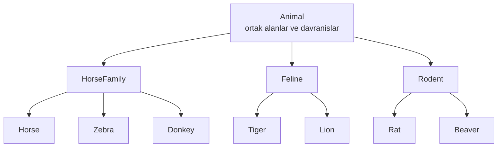
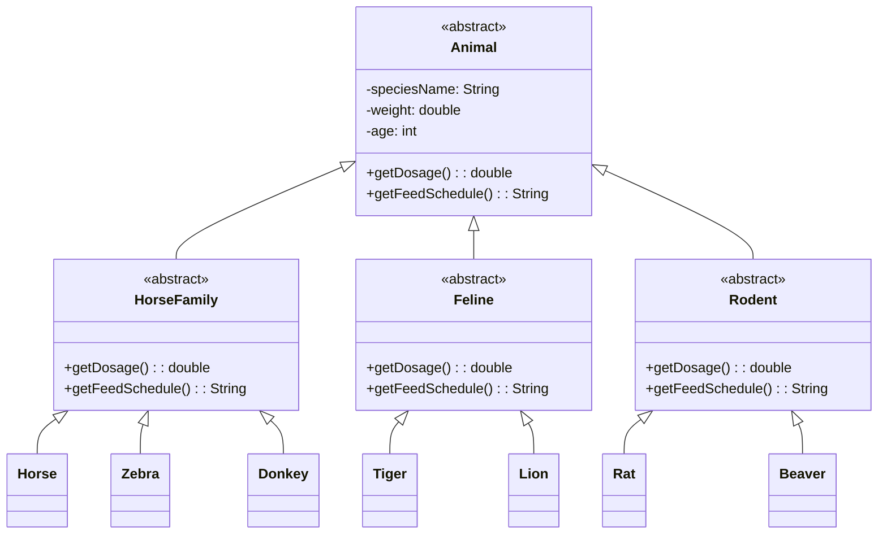

# Odev 1 - Hayvanat Bahcesi Yonetimi

Bu odevde, bir hayvanat bahcesindeki hayvanlari nesne yonelimli programlama prensipleriyle modelleyen bir sinif diyagrami tasarlanmistir.

## Problem Ozeti

Sistemde farkli hayvan gruplari bulunur:

- Atlar grubu: at, zebra, esek vb.
- Kedigiller grubu: kaplan, aslan vb.
- Kemirgenler grubu: sican, kunduz vb.

Tum hayvanlar icin ortak bilgiler saklanir:

- tur adi
- agirlik
- yas

Sistem her hayvan icin su davranislari desteklemelidir:

- `getDosage()`: hayvana uygun ilac dozunu hesaplar
- `getFeedSchedule()`: hayvanin yem verme planini hesaplar

Bu iki davranisin is kurali her hayvan grubu icin farklidir. Bu nedenle cozumde polimorfizm kullanilmistir.

## Tasarim Yaklasimi

- `Animal` soyut sinifi ortak alanlari ve davranis sozlesmesini tanimlar.
- `HorseFamily`, `Feline` ve `Rodent` soyut siniflari kendi gruplarina ozgu beslenme ve dozaj kurallarini uygular.
- `Horse`, `Zebra`, `Donkey`, `Tiger`, `Lion`, `Rat`, `Beaver` gibi turler ilgili gruplardan kalitim alir.
- Sistem `Animal` referansi uzerinden calisir; hangi hayvan geldiyse uygun algoritma override edilen metodlar ile otomatik secilir.

## Gorsel Ozet




## Sinif Diyagrami



## Polimorfizm Nasil Calisir?

Ornek olarak sistemde tum hayvanlar bir listede `Animal` tipinde tutulabilir:

```text
List<Animal> animals
```

Liste icindeki her nesne icin ayni metod cagrisi yapilir:

```text
animal.getDosage()
animal.getFeedSchedule()
```

Ancak calisan metot, nesnenin gercek tipine gore belirlenir.

- `Tiger` nesnesi icin `Feline` kurallari
- `Zebra` nesnesi icin `HorseFamily` kurallari
- `Beaver` nesnesi icin `Rodent` kurallari

Boylece sistem genisletilebilir, okunabilir ve bakimi kolay bir yapi kazanir.

## Kisa Sonuc

Bu tasarimda:

- Ortak ozellikler tek yerde toplandi.
- Grup bazli farkli davranislar override edilerek modellendi.
- Yeni bir hayvan turu eklemek icin sadece uygun gruptan yeni bir sinif turetmek yeterli hale geldi.

Bu yapi, nesne yonelimli programlamadaki kalitim ve polimorfizm kavramlarini dogru bicimde kullanir.
