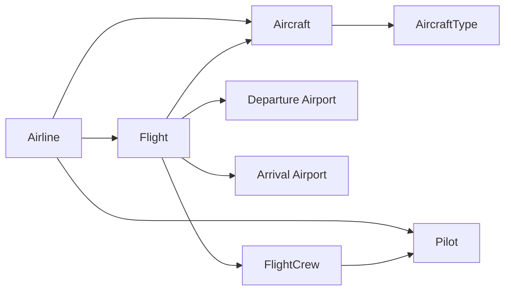
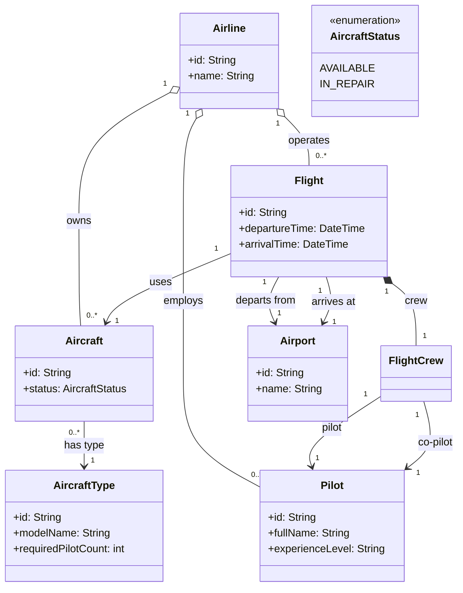

# Odev 2 - Ucus Yonetim Sistemi

Bu odevde, hava yolu sirketleri, ucaklar, pilotlar, havaalanlari ve ucuslar arasindaki iliskileri nesne yonelimli programlama mantigiyla modelleyen bir sinif diyagrami tasarlanmistir.

## Problem Ozeti

Sistemde asagidaki kurallar bulunur:

- Hava yolu sirketleri ucuslari gerceklestirir ve her birinin benzersiz bir kimligi vardir.
- Her hava yolu sirketi farkli tipte ucaklara sahip olabilir.
- Ucaklar ya calisir durumda ya da onarim durumundadir.
- Her ucusun benzersiz kimligi vardir.
- Her ucus icin kalkis ve varis havaalani bilgisi tutulur.
- Her ucus icin kalkis ve inis saati bilgisi tutulur.
- Her ucusta bir pilot ve bir yardimci pilot bulunur.
- Havaalanlarinin benzersiz kimligi ve ismi vardir.
- Pilotlar hava yolu sirketine baglidir ve deneyim seviyesine sahiptir.
- Ucak tipi, gerekli minimum pilot sayisini belirtebilir.

## Tasarim Yaklasimi

- `Airline` sinifi hava yolu sirketini temsil eder.
- `Aircraft` sinifi, bir ucagin hangi sirkete ait oldugu, hangi tipte oldugu ve mevcut durumunu tutar.
- `AircraftType` sinifi ucak tipini ve ilgili tipin gerektirdigi pilot sayisini tanimlar.
- `Flight` sinifi ucusun operasyonel bilgilerini tutar.
- `Airport` sinifi havaalani bilgilerini temsil eder.
- `Pilot` sinifi pilotun kimligini, adini, deneyim seviyesini ve bagli oldugu hava yolu sirketini tutar.
- `FlightCrew` sinifi, bir ucusa atanan pilot ve yardimci pilotu tek bir yapida toplar.

Bu modelde iliskiler composition ve association ile kurulmustur. Boylece sistemde hem varliklar hem de aralarindaki baglantilar net sekilde ifade edilir.

## Gorsel Ozet

## Sinif Diyagrami

## Iliskilerin Aciklamasi

- Bir `Airline`, birden fazla `Aircraft`, `Pilot` ve `Flight` yonetebilir.
- Her `Aircraft`, tek bir `AircraftType` ile iliskilidir.
- Her `Flight`, tek bir ucak ile yapilir.
- Her `Flight`, bir kalkis ve bir varis `Airport` bilgisine sahiptir.
- Her `Flight` icin bir `FlightCrew` nesnesi bulunur.
- `FlightCrew`, bir pilot ve bir yardimci pilot barindirir.
- `AircraftStatus`, ucagin operasyonel durumunu enum yapisi ile ifade eder.

## Kisa Sonuc

Bu tasarimda:

- Sirket, ucus, ucak, pilot ve havaalani varliklari ayri siniflarla modellendi.
- Ucus ekibi ayri bir sinif ile soyutlanarak rol dagilimi netlestirildi.
- Ucak tipi ile gerekli pilot sayisi iliskilendirilerek genisletilebilir bir yapi kuruldu.

Bu sinif diyagrami, ucus operasyonlarinin temel alan nesnelerini ve aralarindaki iliskileri anlasilir bir sekilde ifade eder.
