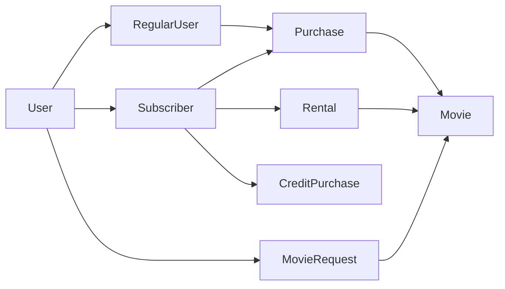
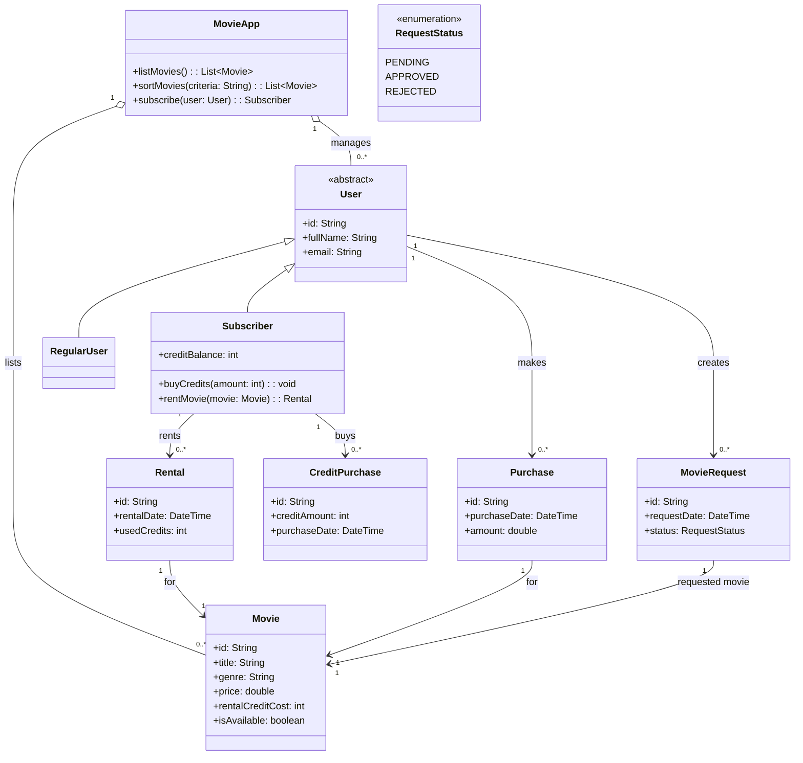

# Odev 3 - Online Film Sistemi

Bu odevde, online ortamda film satan veya kiralayan bir uygulamanin temel nesneleri ve bu nesneler arasindaki iliskiler sinif diyagrami ile modellenmistir.

## Problem Ozeti

Sistem icin beklenen kurallar sunlardir:

- Uygulamada filmler listelenebilir.
- Filmler farkli kriterlere gore siralanabilir.
- Kullanici sisteme normal kullanici olarak katilabilir veya abone olabilir.
- Aboneler sistem uzerinden kredi satin alabilir.
- Sadece aboneler kredi kullanarak film kiralayabilir.
- Film kiralandiginda, ilgili kredi tutari abonenin hesabindan dusulur.
- Hem normal kullanicilar hem de aboneler film satin alabilir.
- Film mevcut degilse kullanici talep olusturabilir.

## Tasarim Yaklasimi

- `MovieApp` sinifi sistemin ana servis katmanini temsil eder ve film listeleme, siralama ve abonelik islemlerini yonetir.
- `User` soyut sinifi tum kullanicilarin ortak ozelliklerini tutar.
- `RegularUser` ve `Subscriber` siniflari farkli kullanici tiplerini temsil eder.
- `Subscriber`, ek olarak kredi bakiyesi tutar ve kredi satin alma ile kiralama islemlerini gerceklestirebilir.
- `Movie` sinifi filmin satis ve kiralama ile ilgili temel bilgilerini tutar.
- `Purchase` ve `Rental` siniflari kullanicinin yaptigi islemleri kaydeder.
- `MovieRequest` sinifi, sistemde olmayan bir film icin kullanicinin talep olusturmasini temsil eder.
- `CreditPurchase` sinifi, abonenin sisteme kredi yuklemesini kayit altina alir.

Bu yapi ile ortak davranislar soyut sinifta toplanir, sadece aboneye ozel davranislar ise alt sinifta modellenir.

## Gorsel Ozet

## Sinif Diyagrami

## Iliskilerin Aciklamasi

- `MovieApp`, sistemdeki filmleri ve kullanicilari yonetir.
- Tum kullanicilar `User` soyut sinifindan turetilir.
- `RegularUser` sadece film satin alabilirken, `Subscriber` hem satin alma hem de kredi ile kiralama yapabilir.
- Her `Purchase` islemi bir kullanici ve bir film ile iliskilidir.
- Her `Rental` islemi sadece `Subscriber` tarafindan yapilir ve kredi tuketir.
- `CreditPurchase`, abonenin hesabina yukledigi kredileri temsil eder.
- `MovieRequest`, sistemde mevcut olmayan bir film icin olusturulan talebi ifade eder.
- `RequestStatus` enum yapisi, talebin durumunu gostermek icin kullanilir.

## Kisa Sonuc

Bu tasarimda:

- Kullanici tipleri kalitim ile ayrildi.
- Satin alma ve kiralama surecleri ayri siniflarla modellendi.
- Abone kullanicilara ozel kredi mantigi net bicimde ayrildi.
- Mevcut olmayan filmler icin talep mekanizmasi sisteme eklendi.

Bu sinif diyagrami, online film satis ve kiralama sisteminin temel alan modelini anlasilir ve genisletilebilir bir yapida sunar.
