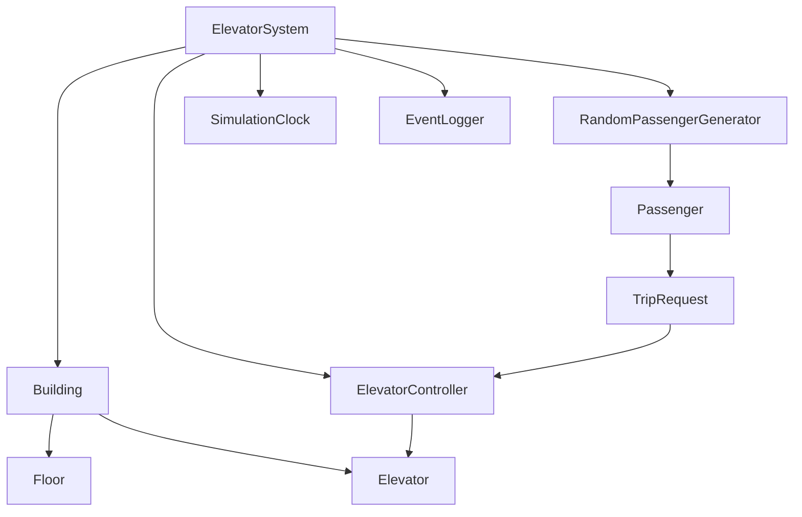
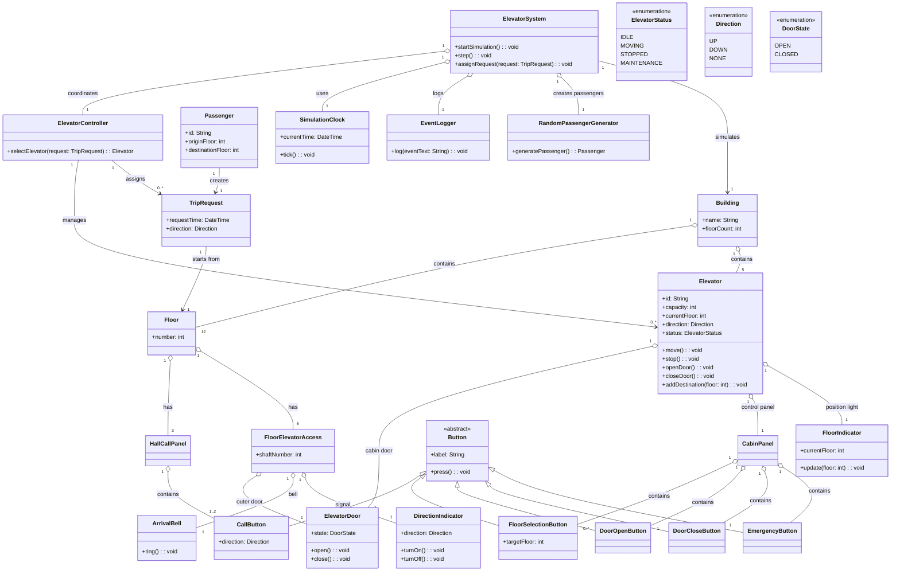

# Odev 4 - Asansor Simulasyonu

Bu odevde, 12 katli bir ofis binasindaki bes asansorun calismasini modelleyen bir sinif diyagrami tasarlanmistir. Tasarimda nesne yonelimli programlamanin temel ilkeleri olan encapsulation, inheritance, polymorphism ve abstraction kullanilmistir.

## Problem Ozeti

Sistemin karsilamasi gereken temel gereksinimler sunlardir:

- Binada 12 kat ve 5 asansor bulunur.
- Her asansor 12 kata da hizmet verebilir.
- Her asansorun yaklasik 6 yetiskin yolcu kapasitesi vardir.
- Asansorler sadece gerektiginde hareket ederek enerji tasarrufu saglar.
- Her asansorun kendi kapisi, kat gostergesi ve kontrol paneli vardir.
- Kontrol panelinde hedef kat dugmeleri, kapi acma, kapi kapama ve acil durum dugmesi bulunur.
- Her katta asansor bosluklari icin kapi, varis zili ve yon bilgisini gosteren sinyal isigi vardir.
- Yolcular, yukari veya asagi cagrisi ile asansor ister.
- Bir kontrol mekanizmasi, uygun asansoru secip ilgili kata yonlendirir.
- Simulasyonda zaman akisi bir saat ile izlenir.
- Olaylar zaman damgali olarak loglanir.
- Yolcu olusturma ve yolculuk bilgileri rastgele sayi uretimi ile saglanir.

## Tasarim Yaklasimi

- `Building` sinifi binayi, katlari ve asansorleri bir arada tutar.
- `ElevatorSystem` sinifi simulasyonun merkezidir; saat, loglama, yolcu uretimi ve asansor kontrolunu koordine eder.
- `ElevatorController` sinifi gelen cagrilar icin uygun asansoru secer.
- `Elevator` sinifi bir asansorun durumunu, yonunu, mevcut katini, kapasitesini ve hedeflerini yonetir.
- `Floor` sinifi kat bilgisini ve katta bulunan cagri paneli ile asansor erisimlerini temsil eder.
- `FloorElevatorAccess` sinifi, bir kat ile belirli bir asansor boslugu arasindaki kapi, zil ve yon isigini modeller.
- `Passenger` sinifi yolcunun baslangic ve hedef kat bilgisini tutar.
- `TripRequest` sinifi bir yolcunun olusturdugu asansor cagrisini temsil eder.
- `CabinPanel` ve `HallCallPanel` siniflari farkli panel tiplerini temsil eder.
- `Button` soyut sinifi, farkli dugme tipleri icin ortak bir soyutlama saglar.
- `CallButton`, `FloorSelectionButton`, `DoorOpenButton`, `DoorCloseButton` ve `EmergencyButton` siniflari polimorfik buton modelleridir.
- `SimulationClock`, `EventLogger` ve `RandomPassengerGenerator` siniflari simulasyon altyapisini destekler.

Bu tasarim, alan nesneleri ile simulasyon altyapisini ayirir. Boylece sistem hem gercek dunyadaki asansor modeline yakin kalir hem de genisletilebilir olur.

## Gorsel Ozet

## Sinif Diyagrami

## Iliskilerin Aciklamasi

- `ElevatorSystem`, simulasyonun merkezi orkestrasyon sinifidir.
- `Building`, 12 kati ve 5 asansoru composition iliskisi ile tutar.
- `ElevatorController`, gelen `TripRequest` nesnelerini uygun `Elevator` ile eslestirir.
- `Elevator`, kendi kapisi, kabin paneli ve kat gostergesi ile kapsullenmis bir yapi sunar.
- `Floor`, hem cagri panellerine hem de her asansor boslugu icin ayri erisim nesnelerine sahiptir.
- `Button` soyut sinifi ve alt siniflari inheritance ve polymorphism kullanimini gosterir.
- `SimulationClock`, `EventLogger` ve `RandomPassengerGenerator`, simulasyonun teknik altyapisini saglar.

## Kisa Sonuc

Bu tasarimda:

- Gercek dunya nesneleri ayri siniflar halinde modellenmistir.
- Dugmeler icin soyutlama ve kalitim kullanilmistir.
- Kontrol, loglama ve zaman yonetimi altyapi siniflarina ayrilmistir.
- Yeni asansor politikalarini veya yeni panel tiplerini eklemek kolaylastirilmistir.

Bu sinif diyagrami, asansor simulasyonunu hem alan modeli hem de simulasyon bilesenleriyle birlikte anlasilir bir bicimde ortaya koyar.
